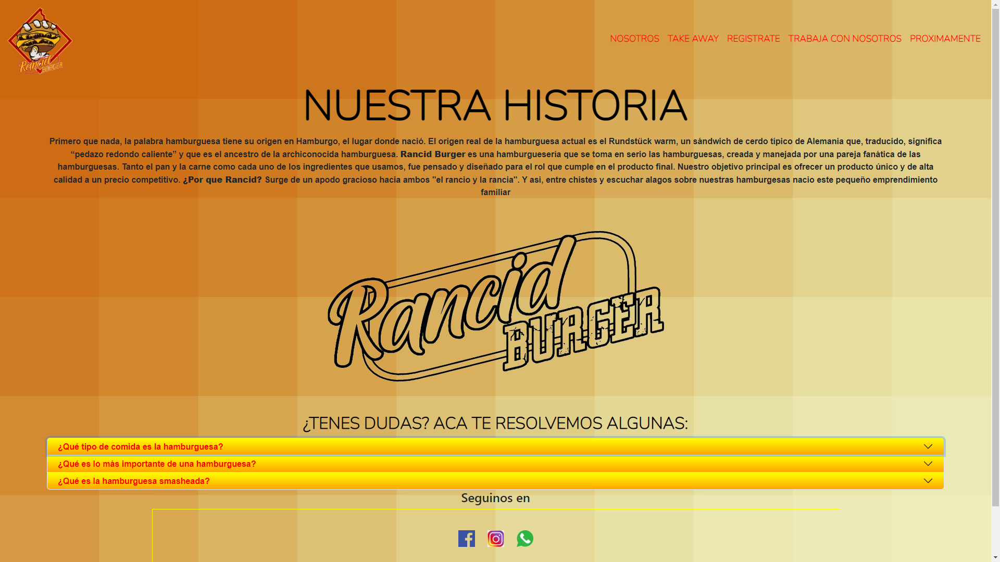

## Proyecto realizado durante el curso de Desarrollo Web de Coderhouse.

 Hola! Me llamo Cintia, este es mi primer sitio web. Es un proyecto de práctica a fin de ganar experiencia en el desarrollo web, fue solicitado durante la cursada en CoderHouse.
    Mis primeros pasos fueron con HTML Y CSS basicos, luego fuimos agregando otras tecnologias como Frameworks (Bootstrap), GitHub y SASS entre otras.- 
       El sitio es 100% responsive.

 # ¿De qué trata el sitio y qué se puede hacer en el?

 Es un sitio enfocado en una hamburgueseria familiar. En el podemos conocer el menú y el tipo de hamburguesa que vendemos. Es un sitio web fictisio con fines educativos y en desarrollo. (Pronto podria ser un sito comercial real).

# DEMO

Index

Pagina de Inicio con carrusel con imagenes de hamburguesas nuevas y servicio de take away. Mas abajo tenemos una imagen con informacion importante sobre el local como dias, horarios y redes sociales.
Nosotros

En la pagina de NOSOTROS encontraran un poco sobre la historia de la hamburguesa, que quiere decir que sea SMASHEADA y como iniciamos en este negocio.
Menú

Aca se despliegan las diferentes hamburguesas y acompañamientos que tenemos para ofrecer.
Registrate

En esta pagina encontraran un formulario de registro.
Trabaja con nosotros

Y en esta última página podran dejar su CV en nuestra base de datos para futuras busquedas laborales. 
